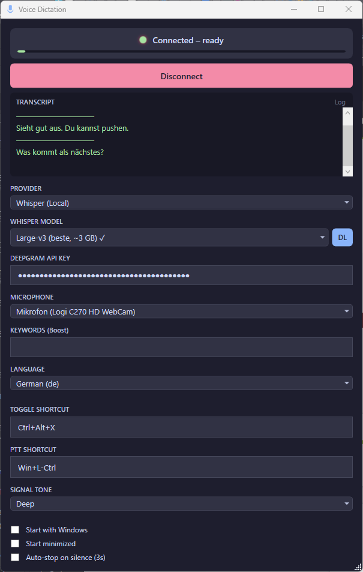

# Voice Dictation

A lightweight Windows desktop app that turns your voice into keystrokes — in real time. Speak into your microphone and the recognized text is typed directly into whichever window has focus.

Built with WPF (.NET 8). Supports two transcription engines: [Deepgram](https://deepgram.com/) Nova-2 (cloud, via WebSocket) and [Whisper.net](https://github.com/sandrohanea/whisper.net) (local, offline, with optional CUDA GPU acceleration).


---

<p align="center">
  
</p>

## Features

- **Dual transcription engines**
  - **Deepgram** (cloud) — Real-time streaming via WebSocket with Nova-3 model, interim results with live preview, automatic reconnect with exponential backoff
  - **Whisper** (local) — Offline transcription using [Whisper.net](https://github.com/sandrohanea/whisper.net) with GGML models, optional CUDA GPU acceleration
- **Types into any window** — Recognized text is injected as simulated keystrokes (Unicode `SendInput`), working in editors, browsers, chat apps, and terminals
- **Terminal-aware** — Automatically detects terminal windows (Windows Terminal, PowerShell, cmd, Warp, Alacritty, etc.) and uses clipboard paste instead of `SendInput`
- **Configurable input delay** — Optional per-character delay for apps that drop fast simulated keystrokes
- **Two input modes** (always active simultaneously)
  - **Toggle** — Press a hotkey to start/stop recording
  - **Push-to-Talk** — Hold a key to record, release to stop
- **AI post-processing** — Optionally send transcribed text through an LLM (OpenAI, Anthropic, OpenRouter, Google Gemini) for cleanup, formatting, or transformation
- **Voice activity detection (VAD)** — Automatically stops recording after silence
- **Text replacements** — Define custom text substitutions applied to transcribed text
- **Transcript export** — Export the current session transcript as a timestamped `.txt` file
- **Configurable shortcuts** — Assign any key or key combination (including Win+key chords) for toggle and PTT
- **Microphone selection** — Choose from available input devices with a live VU meter
- **Keyword boosting** — Improve recognition accuracy for domain-specific terms (Deepgram)
- **Multi-language** — Supports German, English, and automatic language detection
- **Audio feedback** — Choose from 5 signal tone presets (or silence) for recording start/stop
- **System tray** — Minimizes to tray with dynamic status icon, toast notifications for recording and connection state
- **Start minimized** — Optional launch directly to system tray
- **Auto-connect** — Connects automatically on startup if an API key is saved
- **Auto-reconnect** — Deepgram connections are automatically restored with exponential backoff (up to 10 attempts) and toast notifications
- **Settings dialog** — All configuration in one place, including provider selection, shortcuts, audio, and AI settings
- **Themes** — Dark (Catppuccin Mocha) and Light (Catppuccin Latte) color palettes with Auto mode that follows the Windows system setting
- **Mute function** — Mute/unmute the microphone with a configurable shortcut; muted state shown in status bar and tray menu
- **Clipboard mode** — Optionally copy transcribed text to the clipboard instead of typing it
- **First-run wizard** — On first launch, a guided setup wizard helps select a transcription provider and enter API credentials
- **Audio device hot-swap** — Detects when microphones are connected or disconnected and refreshes the device list automatically
- **Transcript search** — Search through saved transcript sessions by keyword with real-time filtering and text highlighting
- **Auto-update check** — Silently checks GitHub Releases on startup and offers a manual check in the About dialog
- **Configurable log level** — Set log verbosity (Debug / Information / Warning) from Settings, applied at runtime

## Important Notes

> **Local Whisper mode** works on CPU out of the box. For faster inference, an NVIDIA GPU with [CUDA drivers](https://www.nvidia.com/drivers) is recommended — the app automatically uses GPU acceleration when available.

> **Deepgram (cloud mode)** requires a [Deepgram account](https://console.deepgram.com/). A free tier is available, but usage beyond the free quota will incur costs. See [Deepgram pricing](https://deepgram.com/pricing) for details.

## Prerequisites

- **Windows 10/11**
- [**.NET 8 SDK**](https://dotnet.microsoft.com/download/dotnet/8.0) or later
- **For Whisper (local):** NVIDIA GPU with CUDA drivers (optional, for faster inference)
- **For Deepgram (cloud):** A [Deepgram API key](https://console.deepgram.com/) (free tier available, pay-as-you-go beyond that)
- Whisper GGML models are downloaded automatically on first use (~150 MB–1.5 GB depending on model size)

## Download

Grab the latest release from the [Releases page](https://github.com/jadirc/VoiceDictation/releases):

| Asset | Description |
|---|---|
| `VoiceDictation-vX.Y.Z-win-x64.zip` | Requires [.NET 8 Runtime](https://dotnet.microsoft.com/download/dotnet/8.0) installed |
| `VoiceDictation-vX.Y.Z-win-x64-portable.zip` | Standalone, no runtime needed (~70 MB) |

## Getting Started

```bash
git clone https://github.com/jadirc/VoiceDictation.git
cd VoiceDictation
dotnet run
```

On first launch, a setup wizard guides you through selecting a transcription provider and entering your credentials. You can also configure everything later via the Settings dialog (gear icon).

## Usage

| Action | Default Shortcut |
|---|---|
| Start/stop recording (toggle mode) | `Ctrl+Alt+X` |
| Record while held (push-to-talk mode) | `Win+L-Ctrl` |

Both input modes are always active simultaneously.

1. **Connect** — Enter your API key in Settings and click *Connect*
2. **Speak** — Press your hotkey and start talking. The transcript appears in the preview panel and is simultaneously typed into the focused window.
3. **Customize shortcuts** — Open Settings and click the shortcut field to record a new key combination
4. **Export transcript** — Click *Export* in the transcript panel or use the tray menu to save the session as a timestamped `.txt` file

Settings are persisted automatically to `%LOCALAPPDATA%\VoiceDictation\settings.json`.

## Architecture

```
VoiceDictation/
├── MainWindow.xaml(.cs)              # UI & orchestration
├── SettingsWindow.xaml(.cs)          # Settings dialog
├── AboutWindow.xaml(.cs)             # About dialog with OSS credits
├── ToastWindow.xaml(.cs)             # Non-intrusive status notifications
├── LogWindow.xaml(.cs)               # Debug log viewer
├── TrayMenuWindow.xaml(.cs)          # Themed tray context menu
├── WelcomeWindow.xaml(.cs)           # First-run setup wizard
├── TranscriptHistoryWindow.xaml(.cs) # Transcript history with search
├── Services/
│   ├── ITranscriptionProvider.cs     # Common interface for transcription engines
│   ├── DeepgramService.cs            # WebSocket streaming to Deepgram Nova-3 (auto-reconnect)
│   ├── WhisperService.cs             # Local offline transcription via Whisper.net
│   ├── WhisperModelManager.cs        # GGML model downloading & caching
│   ├── AudioCaptureService.cs        # Microphone capture (NAudio, 16kHz/16bit/mono)
│   ├── RecordingController.cs        # Recording lifecycle, audio routing, VAD, transcript collection
│   ├── VadService.cs                 # Voice activity detection (auto-stop on silence)
│   ├── KeyboardInjector.cs           # Win32 SendInput / clipboard paste (configurable delay)
│   ├── ReplacementService.cs         # User-defined text substitutions
│   ├── SettingsService.cs            # JSON settings persistence & migration
│   ├── SoundFeedback.cs              # Synthesized WAV tone presets
│   ├── UpdateChecker.cs              # GitHub release update checking
│   └── LogWindowSink.cs              # Serilog sink for the log viewer
├── Helpers/
│   ├── KeyboardHookService.cs        # Low-level keyboard hook (WH_KEYBOARD_LL)
│   ├── TrayIconManager.cs            # System tray icon with dynamic status dot
│   ├── ThemeManager.cs               # Theme switching with dissolve animation
│   └── UiHelper.cs                   # Shared UI helper methods
├── Themes/
│   ├── Dark.xaml                     # Catppuccin Mocha color palette
│   └── Light.xaml                    # Catppuccin Latte color palette
└── Resources/
    └── mic.ico                       # Application icon
```

The app follows a simple code-behind architecture — no DI container or MVVM framework. `MainWindow` is the central orchestrator that wires together the services and manages state. `RecordingController` and `TrayIconManager` are extracted from MainWindow to keep it focused on UI orchestration.

### Data Flow

```
                                                    ┌─ DeepgramService (WebSocket, cloud)
Microphone → AudioCaptureService → RecordingController ─┤                                      → transcript
                                                    └─ WhisperService (local, offline)            ↓
                                                                               ReplacementService → KeyboardInjector → active window
```

## Dependencies

| Package | Purpose |
|---|---|
| [NAudio](https://github.com/naudio/NAudio) 2.2.1 | Audio capture |
| [Whisper.net](https://github.com/sandrohanea/whisper.net) 1.9.0 | Local Whisper transcription |
| Whisper.net.Runtime 1.9.0 | Whisper native runtime (CPU) |
| Whisper.net.Runtime.Cuda.Windows 1.9.0 | Whisper CUDA GPU acceleration |
| [Serilog](https://serilog.net/) 4.2.0 | Structured logging |
| Serilog.Sinks.File 6.0.0 | File log output |

## Building

```bash
dotnet build
```

The project targets `net8.0-windows` and requires `UseWPF` and `UseWindowsForms` (for the tray icon). `AllowUnsafeBlocks` is enabled for Win32 interop structs.

## Logging

Logs are written to `%LOCALAPPDATA%\VoiceDictation\log.txt` (rolling daily, 7-day retention). A built-in log viewer is accessible via the **Log** button in the transcript panel.

## Contributing

Contributions are welcome! Feel free to open issues or submit pull requests.

1. Fork the repository
2. Create a feature branch (`git checkout -b feature/my-feature`)
3. Commit your changes
4. Push to the branch and open a Pull Request

## License

This project is licensed under the MIT License — see the [LICENSE](LICENSE) file for details.

## Acknowledgments

- [Deepgram](https://deepgram.com/) for the real-time cloud speech recognition API
- [Whisper.net](https://github.com/sandrohanea/whisper.net) for local offline transcription
- [NAudio](https://github.com/naudio/NAudio) for .NET audio capture
- UI themes inspired by [Catppuccin](https://github.com/catppuccin/catppuccin) (Mocha & Latte palettes)
